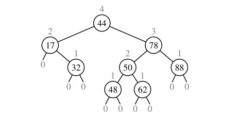
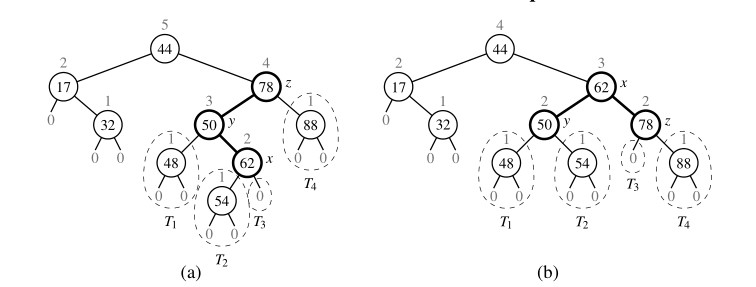
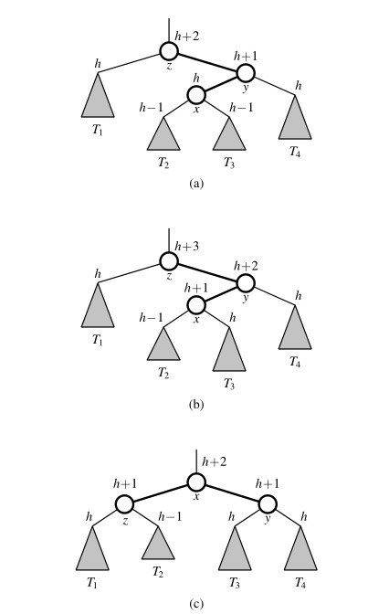
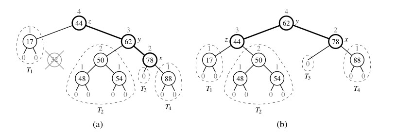

# AVL Tree

The `TreeMap` class, which uses a standard binary search tree as its data structure,
should be an efficient map data structure, but its worst-case performance for the
various operations is linear time, because it is possible that a series of operations
results in a tree with linear height. In this section, we describe a simple balancing
strategy that guarantees worst-case logarithmic running time for all the fundamental
map operations.

The simple correction is to add a rule to the binary search tree definition that will maintain a logarithmic height for the tree. Although we originally defined the height of a subtree rooted at position `p` of a tree to be the number of edges on the longest path from `p` to a leaf, it is easier for explanation in this section to consider the height to be the number of nodes on such a longest path. By this definition, a leaf position has height `1`, while we trivially define the height of a `null` child to be `0`.

In this section, we consider the following ***height-balance property***, which characterizes the structure of a binary search tree `T` in terms of the heights of its nodes.

> ***Height-Balance Property***: For every position `p` of `T`, the heights of the children of `p` differ by at most 1.

Any binary search tree `T` that satisfies the height-balance property is said to be an ***AVL tree***, named after the initials of its inventors: Adel’son-Vel’skii and Landis.

<left>

***Figure 1*** An example of an AVL tree. The keys of the items are shown inside the nodes, and the heights of the nodes are shown above the nodes (with empty subtrees having height 0).
</left>

An immediate consequence of the height-balance property is that a subtree of an AVL tree is itself an AVL tree. The height-balance property has also the important consequence of keeping the height small, as shown in the following proposition.

> ***Proposition 1***: The height of an AVL tree storing n entries is O(log(n)).

## Definition of an AVL Tree

## Update Operations

Given a binary search tree `T`, we say that a position is ***balanced*** if the absolute value of the difference between the heights of its children is at most 1, and we say that it is ***unbalanced*** otherwise. Thus, the height-balance property characterizing AVL trees is equivalent to saying that every position is balanced.

The insertion and deletion operations for AVL trees begin similarly to the corresponding operations for (standard) binary search trees, but with post-processing for each operation to restore the balance of any portions of the tree that are adversely affected by the change.

### Insertion

Suppose that tree `T` satisfies the height-balance property, and hence is an AVL tree, prior to the insertion of a new item. An insertion of a new item in a binary search tree, as described in Section [Insertion and Deletion](../README.md), results in a new node at a leaf position `p`. This action may violate the height-balance property (see, for example, Figure 1a), yet the only positions that may become unbalanced are ancestors of `p`, because those are the only positions whose subtrees have changed. Therefore, let us describe how to restructure `T` to fix any unbalance that may have occurred.

<left>

***Figure 2***: An example insertion of an item with key `54` in the AVL tree of ***Figure 1***: (a) after adding a new node for key `54`, the nodes storing keys `78` and `44` become unbalanced; (b) a tri-node restructuring restores the height-balance property. We show the heights of nodes above them, and we identify the nodes `x`, `y`, and `z` and subtrees `T1`, `T2`, `T3`, and `T4` participating in the tri-node restructuring.
</left>

We restore the balance of the nodes in the binary search tree `T` by a simple "search-and-repair" strategy. In particular, let `z` be the first position we encounter in
going up from `p` toward the `root` of `T` such that `z` is unbalanced (see ***Figure 2a***).
Also, let `y` denote the child of `z` with higher height (and note that `y` must be an
ancestor of `p`). Finally, let `x` be the child of `y` with higher height (there cannot be a
tie and position `x` must also be an ancestor of `p`, possibly `p` itself). We rebalance
the subtree rooted at `z` by calling the tri-node restructuring method, `restructure(x)`,
originally described in Section [Balanced Search Trees](../README.md). An example of such a restructuring in the context of an AVL insertion is portrayed in ***Figure 2***.

To formally argue the correctness of this process in reestablishing the AVL height-balance property, we consider the implication of `z` being the nearest ancestor of `p` that became unbalanced after the insertion of `p`. It must be that the height of `y` increased by one due to the insertion and that it is now `2` greater than its sibling. Since `y` remains balanced, it must be that it formerly had subtrees with equal heights, and that the subtree containing `x` has increased its height by one. That subtree increased either because `x = p`, and thus its height changed from `0` to `1`, or because `x` previously had equal-height subtrees and the height of the one containing `p` has increased by `1`. Letting `h >= 0` denote the height of the tallest child of `x`, this scenario might be portrayed as in ***Figure 3***.

After the tri-node restructuring, we see that each of `x`, `y`, and `z` has become balanced. Furthermore, the node that becomes the root of the subtree after the restructuring has height`h + 2`, which is precisely the height that `z` had before the insertion of the new item. Therefore, any ancestor of `z` that became temporarily unbalanced becomes balanced again, and this one restructuring restores the height-balance property ***globally***.

<left>

***Figure 3***: Re-balancing of a subtree during a typical insertion into an AVL tree: (a) before the insertion; (b) after an insertion in subtree `T3` causes imbalance at `z`; (c) after restoring balance with tri-node restructuring. Notice that the overall height of the subtree after the insertion is the same as before the insertion.
</left>

### Deletion

Recall that a deletion from a regular binary search tree results in the structural removal of a node having either zero or one children. Such a change may violate the height-balance property in an AVL tree. In particular, if position `p` represents the parent of the removed node in tree `T`, there may be an unbalanced node on the path from `p` to the root of `T`. (See ***Figure 4a***.) In fact, there can be at most one such unbalanced node.

<left>

**Figure 4**: Deletion of the item with key `32` from the AVL tree of ***Figure 2b***: (a) after removing the node storing key `32`, the root becomes unbalanced; (b) a (single) rotation restores the height-balance property.
</left>

As with insertion, we use tri-node restructuring to restore balance in the tree `T`. In particular, let `z` be the first unbalanced position encountered going up from `p` toward the root of `T`. Also, let `y` be the child of `z` with larger height (note that position `y` is the child of `z` that is not an ancestor of `p`), and let `x` be the child of `y` defined as follows: If one of the children of `y` is taller than the other, let `x` be the taller child of `y`; else (both children of `y` have the same height), let `x` be the child of `y` on the same side as `y` (that is, if `y` is the left child of `z`, let `x` be the left child of `y`, else let `x` be the right child of `y`). In any case, we then perform a `restructure(x)`
operation. (See ***Figure 4b***.)

The restructured subtree is rooted at the middle position denoted as `b` in the description of the tri-node restructuring operation. The height-balance property is guaranteed to be ***locally*** restored within the subtree of `b`. Unfortunately, this tri-node restructuring may reduce the height of the subtree rooted at `b` by 1, which may cause an ancestor of `b` to become  unbalanced. So, after re-balancing `z`, we continue walking up `T` looking for unbalanced positions. If we find another, we perform a restructure operation to restore its balance, and continue marching up `T` looking for more, all the way to the root. Still, since the height of `T` is `O(log(n))`, where n is the number of entries, by ***Proposition 1***,
`O(log(n))` tri-node restructurings are sufficient to restore the height-balance property.

📊 By ***Proposition 1***, the height of an AVL tree with `n` items is guaranteed to be
`O(log(n))`. Because the standard binary search tree operation had running times bounded by the height (see ***Table*** below), and because the additional work in maintaining balance factors and restructuring an AVL tree can be bounded by the length of a path in the tree, the traditional map operations run in worst-case logarithmic time with an AVL tree. We summarize these results in Table below.

| **Operation** | **Running Time** |
| --- | --- |
| `k in T` | `O(log(n))` |
| `T[k] = v` | `O(log(n))` |
| `T.delete(p)`, `del T[k]` | `O(log(n))` |
| `T.find_position(k)` | `O(log(n))` |
| `T.first()`, `T.last()`, `T.find_min()`, `T.find_max()` | `O(log(n))` |
| `T.before(p)`, `T.after(p)` | `O(log(n))` |
| `T.find_lt(k)`, `T.find_le(k)`, `T.find_gt(k)`, `T.find_ge(k)` | `O(log(n))` |
| `T.find_range(start, stop)` | `O(s + log(n))` |
| `iter(T)`, `reversed(T)` | `O(n)` |

<left>

***Table***: Worst-case running times of operations for an `n-item` sorted map realized as an AVL tree `T`, with `s` denoting the number of items reported by `find_range`.
</left>

## Python Implementation

A complete implementation of an `AVLTreeMap` class is provided in [AVL Tree](../AVLTree.py). It inherits from the standard `TreeMap` class and relies on the balancing framework described in Section [Python Frameworks for Balancing Search Trees](../README.md). We highlight two important aspects of our implementation. First, the `AVLTreeMap` overrides the definition of
the nested `_Node` class, in order to provide support for storing the height of the subtree stored at a node. We also provide several utilities involving heights of nodes, and the corresponding positions.

To implement the core logic of the AVL balancing strategy, we define a utility, named `_rebalance`, that suffices as a hook for restoring the height-balance property after an insertion or a deletion. Although the inherited behaviors for insertion and deletion are quite different, the necessary post-processing for an AVL tree can be unified. In both cases, we trace an upward path from the position `p` at which the change took place, recalculating the height of each position based on the (updated) heights of its children, and using a tri-node restructuring operation if an imbalanced position is reached. If we reach an ancestor with height that is unchanged by the overall map operation, or if we perform a tri-node restructuring that results in the subtree having the same height it had before the map operation, we stop the process; no further ancestor’s height will change. To detect the stopping condition, we record the "old" height of each node and compare it to the newly calculated height.
