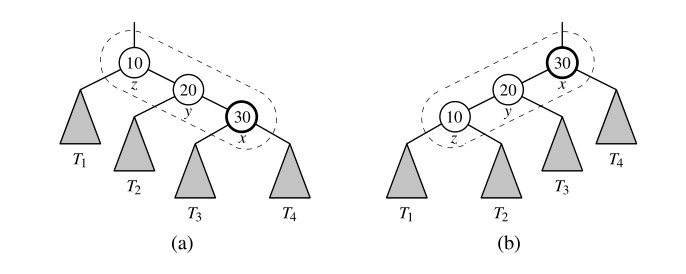
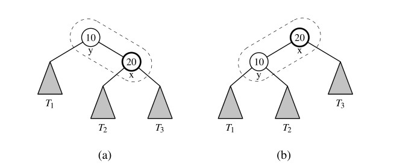
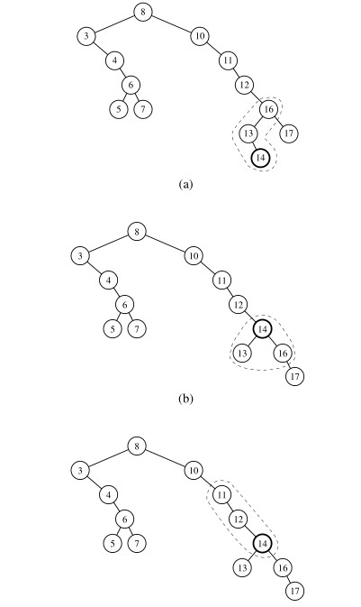
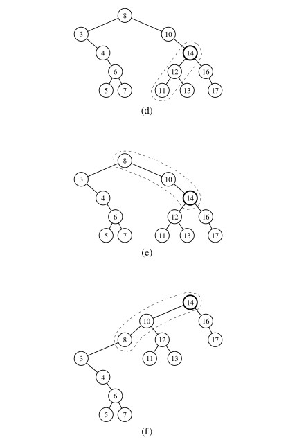
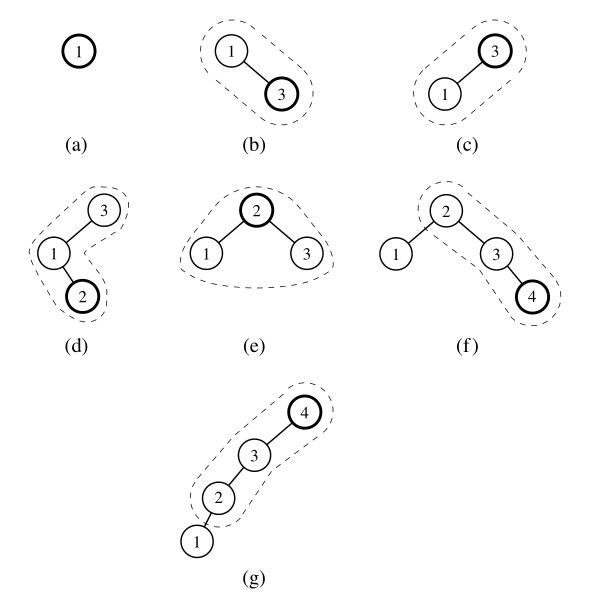
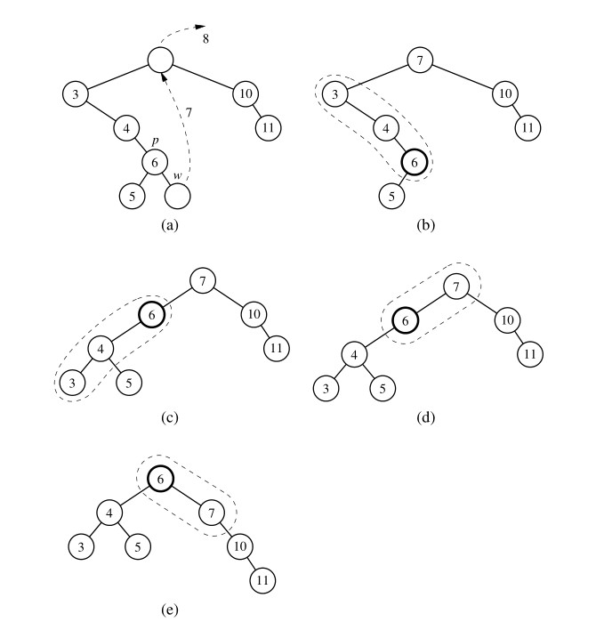

# Splay Tree

The next search tree structure we study is known as a a ***splay tree***. This structure is
conceptually quite different from the other balanced search trees we discuss in this chapter, for a splay tree does not strictly enforce a logarithmic upper bound on the height of the tree. In fact, there are no additional height, balance, or other auxiliary data associated with the nodes of this tree.

The efficiency of splay trees is due to a certain move-to-root operation, called splaying, that is performed at the bottommost position p reached during every insertion, deletion, or even a search. (In essence, this is a tree variant of the move-to-front heuristic).  Intuitively, a splay operation causes more frequently accessed elements to remain nearer to the root, thereby reducing the typical search times. The surprising thing about splaying is
that it allows us to guarantee a logarithmic amortized running time, for insertions,
deletions, and searches.

## Splaying

Given a node `x` of a binary search tree `T`, we splay `x` by moving `x` to the root of `T`
through a sequence of restructurings. The particular restructurings we perform are important, for it is not sufficient to move `x` to the root of `T` by just any sequence of restructurings. The specific operation we perform to move `x` up depends upon the relative  positions of `x`, its parent `y`, and (if it exists) `x`’s grandparent `z`. There are three cases that we consider.

- `zig-zig`: The node `x` and its parent `y` are both left children or both right children. (See ***Figure 1***) We promote `x`, making `y` a child of `x` and `z` a child of `y`, while maintaining the inorder relationships of the nodes in `T`.
  
  

  <left>

  **Figure 1** Zig-zig: (a) before; (b) after. There is another symmetric configuration where `x` and `y` are left children.
  </left>

- `zig-zag`: One of `x` and `y` is a left child and the other is a right child. (See ***Figure 2***) In this case, we promote `x` by making `x` have `y` and `z` as its children, while maintaining the inorder relationships of the nodes in `T`.
  
  

  <left>

  **Figure 2**  Zig-zag: (a) before; (b) after. There is another symmetric configuration where `x` is a right child and `y` is a left child.
  </left>

- `zig`: `x` does not have a grandparent. (See Figure 3) In this case, we perform a single rotation to promote `x` over `y`, making `y` a child of `x`, while maintaining the relative inorder relationships of the nodes in `T`.
  
  

  <left>

  ***Figure 3***: Zig: (a) before; (b) after. There is another symmetric configuration where `x` is originally a left child of `y`.
  </left>

We perform a `zig-zig` or a `zig-zag` when `x` has a grandparent, and we perform a `zig` when `x` has a parent but not a grandparent. A splaying step consists of repeating these restructurings at `x` until `x` becomes the root of `T`. An example of the splaying of a node is shown in ***Figures 4 and 5***.

<left>

**Figure 4**: Example of splaying a node: (a) splaying the node storing 14 starts with a zig-zag; (b) after the zig-zag; (c) the next step will be a zig-zig. (Continues in ***Figure 5***)
</left>

<left>

**Figure 5**: Example of splaying a node:(d) after the zig-zig; (e) the next step is again a zig-zig; (f) after the zig-zig. (Continued from ***Figure 4***)
</left>

## When to Splay

The rules that dictate when splaying is performed are as follows

- When searching for key `k`, if `k` is found at position `p`, we splay `p`, else we splay the leaf position at which the search terminates unsuccessfully. For example, the splaying in ***Figures 4 and 5*** would be performed after searching successfully for key 14 or unsuccessfully for key 15.
- When inserting key `k`, we splay the newly created internal node where `k` gets inserted. For example, the splaying in ***Figures 4 and 5*** would be performed if 14 were the newly inserted key. We show a sequence of insertions in a splay tree in ***Figure 6***.
  
  

  <left>

  **Figure 6**: A sequence of insertions in a splay tree: (a) initial tree; (b) after inserting 3, but before a zig step; (c) after splaying; (d) after inserting 2, but before a zig-zag step; (e) after splaying; (f) after inserting 4, but before a zig-zig step; (g) after splaying.
  </left>

- When deleting a key `k`, we splay the position `p` that is the parent of the removed node; recall that by the removal algorithm for binary search trees, the removed node may be that originally containing `k`, or a descendant node with a replacement key. An example of splaying following a deletion is shown in ***Figure 7***.
  
  

  <left>

  **Figure 7**: Deletion from a splay tree: (a) the deletion of 8 from the root node is performed by moving to the root the key of its inorder predecessor `w`, deleting `w`, and splaying the parent `p` of `w`; (b) splaying `p` starts with a zig-zig; (c) after the zig-zig; (d) the next step is a zig; (e) after the zig.
  </left>

## Python Implementation

Although the mathematical analysis of a splay tree’s performance is complex (see Section [Analysis of Splaying](#analysis-of-splaying)), the *implementation* of splay trees is a rather simple adaptation to a standard binary search tree. We provides a complete implementation of a `SplayTreeMap` class, based upon the underlying `TreeMap` class and use of the balancing framework described in Section [Python Frameworks for Balancing Search Trees](../README.md). It is important to note that our original `TreeMap` class makes calls to the `_rebalance_access` method, not just from within the `__getitem__` method, but also during `__setitem__` when modifying the value associated with an existing key, and after any map operations that result in a failed search.

## Analysis of Splaying

May be updated later 😎
