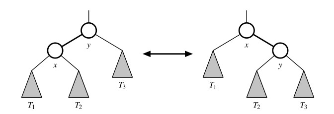
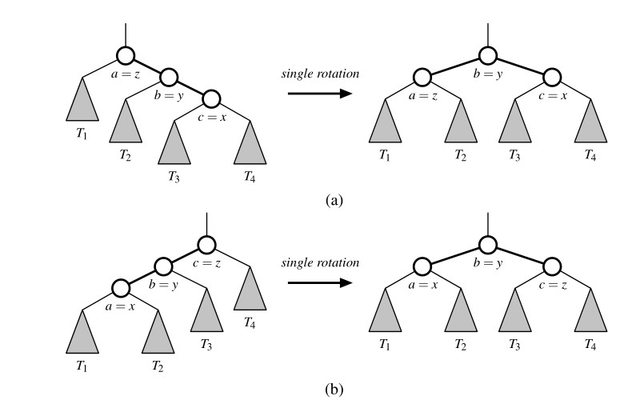
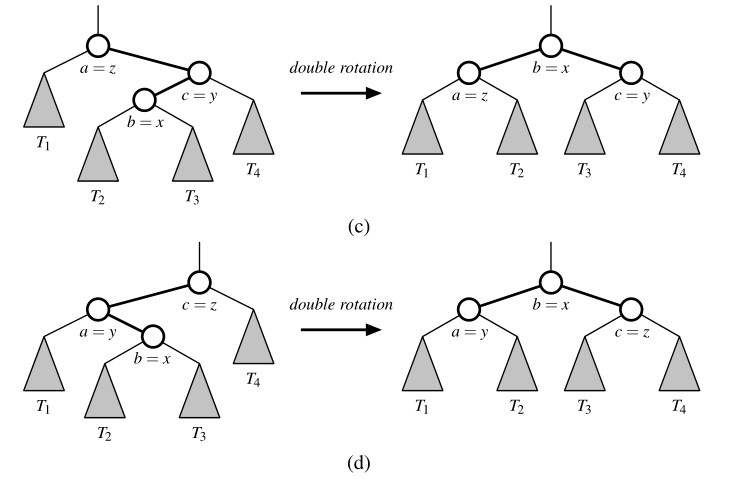

# Search Trees

## Binary Search Trees

We have introduced the tree data structure and demonstrated a variety of applications (see [here](../../Tree/README.md)). One important use is as a ***search tree***. In this instructions, we use a search tree structure to efficiently implement a ***sorted map***. The three most fundamental methods of a map `M` are

- `M[k]`: Return the value `v` associated with key `k` in map `M`, if one exists; otherwise raise a `KeyError`; implemented with `__getitem__` method.
- `M[k] = v`: Associate value `v` with key `k` in map `M`, replacing the existing value if the map already contains an item with key equal to `k`; implemented with `__setitem__` method.
- `del M[k]`: Remove from map `M` the item with key equal to `k`; if `M` has no such item, then raise a `KeyError`; implemented with `__delitem__` method.

The sorted map ADT includes additional functionality (see [Section Sorted Map](../../Maps/README.md)), guaranteeing that an iteration reports keys in sorted order, and supporting additional searches such as `find_gt(k)` and `find_range(start, stop)`.

Binary trees are an excellent data structure for storing items of a map, assuming we have an order relation defined on the keys. In this context, a binary search tree is a binary tree `T` with each position `p` storing a key-value pair `(k,v)` such that

- Keys stored in the left subtree of `p` are less than `k`.
- Keys stored in the right subtree of `p` are greater than `k`.

### Navigating a Binary Search Tree

We begin by demonstrating that a binary search tree hierarchically represents the sorted order of its keys. In particular, the structural property regarding the placement of keys within a binary search tree assures the following important consequence regarding an ***inorder traversal*** of the tree.

> ***Proposition 1***: *An inorder traversal of a binary search tree visits positions in increasing order of their keys*.

We left the justification of this Proposition here.

Since an inorder traversal can be executed in linear time, a consequence of this proposition is that we can produce a sorted iteration of the keys of a map in linear time, when represented as a binary search tree.

Although an inorder traversal is typically expressed using a top-down recursion, we can provide non-recursive descriptions of operations that allow more fine-grained navigation among the positions of a binary search relative to the order of their keys. Our generic binary tree ADT from [Tree](../../Tree/README.md) is defined as a positional structure, allowing direct navigation using methods such as `parent(p)`, `left(p)`, and `right(p)`. With a binary *search* tree, we can provide additional navigation based on the natural order of the keys stored in the tree. In particular, we can support the following methods, akin to those provided by a [PositionalList](../../List/README.md).

- `first():` Return the position containing the least key, or `None` if the tree is empty.
- `last()`: Return the position containing the greatest key, or `None` if empty tree.
- `before(p)`: Return the position containing the greatest key that is less than that of position `p` (i.e., the position that would be visited immediately before `p` in an inorder traversal), or `None` if `p` is the first position.
- `after(p)`: Return the position containing the least key that is greater than that of position `p` (i.e., the position that would be visited immediately after `p` in an inorder traversal), or `None` if `p` is the last position.

The `first` position of a binary search tree can be located by starting a walk at the `root` and continuing to the left child, as long as a left child exists. By symmetry,
the last position is reached by repeated steps rightward starting at the root.

The successor of a position, `after(p)`, is determined by the following algorithm.

```python
Algorithm after(p):
    if right(p) is not None then {successor is leftmost position in p’s right subtree}
        walk = right(p)
        while left(walk) is not None do
            walk = left(walk)
        return walk
    else {successor is nearest ancestor having p in its left subtree}
        walk = p
        ancestor = parent(walk)
        while ancestor is not None and walk == right(ancestor) do
            walk = ancestor
            ancestor = parent(walk)
        return ancestor
```

The rationale for this process is based purely on the workings of an inorder
traversal, given the correspondence of ***Proposition 1***. If `p` has a right subtree,
that right subtree is recursively traversed immediately after `p` is visited, and so the
first position to be visited after `p` is the *leftmost* position within the right subtree. If `p` does not have a right subtree, then the flow of control of an inorder traversal returns to p’s parent. If `p` were in the *right* subtree of that parent, then the parent’s subtree traversal is complete and the flow of control progresses to its parent and so on. Once an ancestor is reached in which the recursion is returning from its
left subtree, then that ancestor becomes the next position visited by the inorder
traversal, and thus is the successor of `p`. Notice that the only case in which no such
ancestor is found is when `p` was the rightmost (last) position of the full tree, in
which case there is no successor.

A symmetric algorithm can be defined to determine the predecessor of a position, `before(p)`. At this point, we note that the running time of single call to `after(p)` or `before(p)` is bounded by the height `h` of the full tree, because it is found after either a single downward walk or a single upward walk. While the worst-case running time is `O(h)`, we note that either of these methods run in `O(1)` amortized time, in that series of `n` calls to `after(p)` starting at the first position will execute in a total of `O(n)` time.

### Search

The most important consequence of the structural property of a binary search tree is its namesake search algorithm. We can attempt to locate a particular key in a binary search tree by viewing it as a decision tree. In this case, the question asked at each position `p` is whether the desired key `k` is less than, equal to, or greater than the key stored at position `p`, which we denote as `p.key()`. If the answer is "less than", then the search continues in the *left subtree*. If the answer is "equal", then the search terminates successfully. If the answer is "greater than", then the search continues in the *right subtree*. Finally, if we reach an empty subtree, then the search terminates unsuccessfully.

We describe this approach in **Code Fragment** below. If key `k` occurs in a subtree
rooted at `p`, a call to `TreeSearch(T, p, k)` results in the position at which the key
is found; in this case, the `__getitem__` map operation would return the associated
value at that position. In the event of an unsuccessful search, the `TreeSearch` algorithm returns the *final position* explored on the search path (which we will later
make use of when determining where to insert a new item in a search tree).

```python
Algorithm TreeSearch(T, p, k):
    if k == p.key() then
        return p    {successful search}
    else if k < p.key() and T.left(p) is not None then
        return TreeSearch(T, T.left(p), k)      {recur on left subtree}
    else if k > p.key() and T.right(p) is not None then
        return TreeSearch(T, T.right(p), k)     {recur on right subtree}
    return p        {unsuccessful search}
```

#### Analysis of Binary Tree Searching (Updating)

### Insertion and Deletion

Algorithms for inserting or deleting entries of a binary search tree are fairly straight-forward, although not trivial.

#### Insertion

The map command `M[k] = v`, as supported by the `__setitem__` method, begins with a search for key `k` (assuming the map is nonempty). If found, that item’s existing value is reassigned. Otherwise, a node for the new item can be inserted into the underlying tree `T` in place of the empty subtree that was reached at the end of the failed search. The binary search tree property is sustained by that placement (note that it is placed exactly where a search would expect it). Pseudo-code for such a `TreeInsert` algorithm is given in in **Code Fragment** below.

```python
Algorithm TreeInsert(T, k, v):
    Input: A search key k to be associated with value v
    p = TreeSearch(T,T.root(),k)
    if k == p.key() then
        Set p’s value to v
    else if k < p.key() then
        add node with item (k,v) as left child of p
    else
        add node with item (k,v) as right child of p
```

#### Deletion

Deleting an item from a binary search tree `T` is a bit more complex than inserting a new item because the location of the deletion might be anywhere in the tree. (In contrast, insertions are always enacted at the bottom of a path.) To delete an item with key `k`, we begin by calling `TreeSearch(T, T.root(), k)` to find the position `p`, of `T` storing an item with key equal to `k`. If the search is successful, we distinguish between two cases (of increasing difficulty)

- If `p` has at most one child, the deletion of the node at position `p` is easily implemented. When introducing update methods for the `LinkedBinaryTree` class in [Section Linked Binary Structure](../../Tree/README.md), we declared a nonpublic utility, `_delete(p)`, that deletes a node at position `p` and replaces it with its child (if any), presuming that `p` has at most one child. That is precisely the desired behavior. It removes the item with key `k` from the map while maintaining all other ancestor-descendant relationships in the tree, thereby assuring the upkeep of the binary search tree property.
- If position `p` has two children, we cannot simply remove the node from `T` since this would create a "hole" and two orphaned children. Instead, we proceed as follow
  - We locate position `r` containing the item having the greatest key that is strictly less than that of position `p`, that is, r = before(p) by the notation of Section [Navigating](#navigating-a-binary-search-tree). Because `p` has two children, its predecessor is the rightmost position of the left subtree of `p`
  - We use `r`’s item as a replacement for the one being deleted at position `p`. Because `r` has the immediately preceding key in the map, any items in `p`’s right subtree will have keys greater than `r` and any other items in `p`'s left subtree will have keys less than `r`. Therefore, the binary search tree property is satisfied after the  replacement.
  - Having used `r`’s as a replacement for `p`, we instead delete the node at position `r` from the tree. Fortunately, since r was located as the rightmost position in a subtree, `r` does not have a right child. Therefore, its deletion can be performed using the first (and simpler) approach.

As with searching and insertion, this algorithm for a deletion involves the traversal of a single path downward from the root, possibly moving an item between two positions of this path, and removing a node from that path and promoting its child. Therefore, it executes in time `O(h)` where `h` is the height of the tree.

### Python Implementation

We define a `TreeMap` class that implements the sorted map ADT using a binary search tree. In fact, our implementation is more general. We support all of the standard map operations, all additional sorted map operations, and positional operations including
`first()`, `last()`, `find_position(k)`, `before(p)`, `after(p)`, and `delete(p)`.

Our `TreeMap` class takes advantage of multiple inheritance for code reuse, inheriting from the `LinkedBinaryTree` class for our representation as a positional binary tree, and from the `MapBase` class provide us with the key-value composite item and the concrete
behaviors from the collections.MutableMapping abstract base class. We subclass the nested Position class to support more specific `p.key()` and `p.value()` accessors for our map, rather than the `p.element()` syntax inherited from the `tree` ADT.

We define several nonpublic utilities, most notably a `_subtree_search(p, k)` method that corresponds to the `TreeSearch` algorithm . That returns a position, ideally one that contains the key `k`, or otherwise the last position that is visited on the search path. We rely on the fact that the final position during an unsuccessful search is either the nearest key less than `k` or the nearest key greater than `k`. This search utility becomes the basis for the public `find_position(k)` method, and also for internal use when searching, inserting, or deleting items from a map, as well as for the robust searches of the sorted map ADT.

When making structural modifications to the tree, we rely on nonpublic update methods, such as `_add_right`, that are inherited from the `LinkedBinaryTree` class. It is important that these inherited methods remain nonpublic, as the search tree property could be violated through misuse of such operations.

Finally, we note that our code is peppered with calls to presumed methods named `_rebalance_insert`, `_rebalance_delete`, and `_rebalance_access`. These methods serve as hooks for future use when balancing search trees; we discuss them in Section [Framework](#python-framework-for-balancing-search-trees). We conclude with a brief guide to the organization of our code.

### Performance of a Binary Search Tree (Updating)

## Balanced Search Trees

In the closing of the previous section, we noted that if we could assume a random series of insertions and removals, the standard binary search tree supports `O(log(n))` expected running times for the basic map operations. However, we may only claim `O(n)` worst-case time, because some sequences of operations may lead to an unbalanced tree with height proportional to `n`.

In this section, we explore three search tree algorithms that provide stronger performance guarantees(AVL trees, splay trees, and red-black trees), these are based on augmenting a standard binary search tree with occasional operations to reshape the tree and reduce its height.

The primary operation to rebalance a binary search tree is known as a rotation. During a  ***rotation***, we "rotate" a child to be above its parent, as diagrammed in
***Figure 1***.



<left> ***Figure 1***. A rotation operation in a binary search tree. A rotation can be performed to transform the left formation into the right, or the right formation into the left. Note that all keys in subtree `T1` have keys less than that of position `x`, all keys in subtree `T2` have keys that are between those of positions `x` and `y`, and all keys in subtree `T3` have keys that are greater than that of position `y`. </left>

To maintain the binary search tree property through a rotation, we note that if position `x` was a left child of position `y` prior to a rotation (and therefore the key of `x` is less than the key of `y`), then `y` becomes the right child of `x` after the rotation, and vice versa. Furthermore, we must relink the subtree of items with keys that lie between the keys of the two positions that are being rotated. For example, in ***Figure 1*** the subtree labeled `T2` represents items with keys that are known to be greater than that of position `x` and less than that of position `y`. In the first configuration of that figure, `T2` is the right subtree of position `x`; in the second configuration, it is the left subtree of position `y`.

Because a single rotation modifies a constant number of parent-child relationships, it can be implemented in `O(1)` time with a linked binary tree representation.

In the context of a tree-balancing algorithm, a rotation allows the shape of a tree to be modified while maintaining the search tree property. If used wisely, this operation can be performed to avoid highly unbalanced tree configurations. For example, a rightward rotation from the first formation of **Figure 1** above to the second reduces the depth of each node in subtree `T1` by one, while increasing the depth of each node in subtree `T3` by one. (Note that the depth of nodes in subtree `T2` are unaffected by the rotation.)

One or more rotations can be combined to provide broader re-balancing within a tree. One such compound operation we consider is a ***tri-node restructuring***. For this manipulation, we consider a position `x`, its parent `y`, and its grandparent `z`. The goal is to restructure the subtree rooted at `z` in order to reduce the overall path length to `x` and its subtrees. Pseudo-code for a `restructure(x)` method is given in **Code Fragment** below and illustrated in **Figure 2**. In describing a tri-node restructuring, we temporarily rename the positions `x`, `y`, and `z` as `a`, `b`, and `c`, so that `a` precedes `b` and `b` precedes `c` in an inorder traversal of `T`. There are four possible orientations mapping `x`, `y`, and `z` to a, `b`, and `c`, as shown in **Figure 2** below, which are unified into one case by our relabeling. The tri-node restructuring replaces `z` with the node identified as `b`, makes the children of this node be `a` and `c`, and makes the children of `a` and `c` be the four previous children of `x`, `y`, and `z` (other than `x` and `y`), while maintaining the inorder relationships of all the nodes in `T`.

```python
Algorithm restructure(x):
    Input: A position x of a binary search tree T that has both a parent y and a grandparent z
    Output: Tree T after a tri-node restructuring (which corresponds to a single or double rotation) involving positions x, y, and z
1: Let (a, b, c) be a left-to-right (inorder) listing of the positions x, y, and z, and let (T1,T2,T3,T4) be a left-to-right (inorder) listing of the four subtrees of x, y, and z not rooted at x, y, or z.
2: Replace the subtree rooted at z with a new subtree rooted at b.
3: Let a be the left child of b and let T1 and T2 be the left and right subtrees of a, respectively.
4: Let c be the right child of b and let T3 and T4 be the left and right subtrees of c, respectively.
```

In practice, the modification of a tree `T` caused by a tri-node restructuring operation can be implemented through case analysis either as a single rotation or as a double rotation. The double  rotation arises when position `x` has the middle of the three relevant keys and is first rotated above its parent, and then above what was originally its grandparent. In any of the cases, the tri-node restructuring is completed with `O(1)` running time




<left>

***Figure 2***: Schematic illustration of a trinode restructuring operation: (a and b)
require a single rotation; (c and d) require a double rotation.
</left>

### Python Framework for Balancing Search Trees

Our `TreeMap` class, introduced in Section [Python Implementation](#python-implementation), is a concrete map implementation that does not perform any explicit balancing operations. However, we designed that class to also serve as a base class for other subclasses that implement more advanced tree-balancing algorithms.

#### Hook for Re-balancing Operations

Our implementation of the basic map operations in Section [Python Implementation](#python-implementation) includes strategic calls to three nonpublic methods that serve as hooks for re-balancing algorithms

- A call to `_rebalance_insert(p)` is made from within the `__setitem__` method immediately after a new node is added to the tree at position `p`.
- A call to `_rebalance_delete(p)` is made each time a node has been deleted from the tree, with position `p` identifying the parent of the node that has just been removed. Formally, this hook is called from within the public `delete(p)` method, which is indirectly invoked by the public `__delitem__(k)` behavior.
- We also provide a hook, `_rebalance_access(p)`, that is called when an item at position `p` of a tree is accessed through a public method such as `__getitem__`. This hook is used by the splay tree structure to restructure a tree so that more frequently accessed items are brought closer to the root.

We provide trivial declarations of these three methods, in **Code Fragment** below, having bodies that do nothing (using the `pass` statement). A subclass of `TreeMap` may override any of these methods to implement a nontrivial action to rebalance a tree. This is another example of the ***template method design pattern***.

```python
def _rebalance_insert(self, p): pass
def _rebalance_delete(self, p): pass
def _rebalance_access(self, p): pass
```

#### Nonpublic Methods for Rotating and Restructuring

A second form of support for balanced search trees is our inclusion of non-public utility methods `_rotate` and `_restructure` that, respectively, implement a single
rotation and a tri-node restructuring (described at the beginning of Section [Balanced Search Tree](#balanced-search-trees)). Although these methods are not invoked by the public `TreeMap` operations, we promote code reuse by providing these implementation in this class so that they are inherited by all balanced-tree subclasses.

Our implementations are provided in source code. To simplify the code, we define an additional
`_relink` utility that properly links parent and child nodes to each other, including the special case in which a "child" is a `None` reference. The focus of the `_rotate` method then becomes redefining the relationship between the parent and child, relinking a rotated node directly to its original grandparent, and shifting the "middle" subtree (that labeled as `T2` in ***Figure 1***) between the rotated nodes. For the tri-node restructuring, we determine whether to perform a single or double rotation, as originally described in ***Figure 2***.

### Factory for Creating Tree Nodes

We draw attention to an important subtlety in the design of both our `TreeMap` class
and the original `LinkedBinaryTree` subclass. The low-level definition of a node is
provided by the nested `_Node` class within `LinkedBinaryTree`. Yet, several of our
tree-balancing strategies require that auxiliary information be stored at each node
to guide the balancing process. Those classes will override the nested `_Node` class
to provide storage for an additional field.

Whenever we add a new node to the tree, as within the `_add_right` method of the `LinkedBinaryTree`, we intentionally instantiate the node using the syntax `self._Node`, rather than the qualified name `LinkedBinaryTree._Node`. This is vital to our framework! When the expression `self._Node` is applied to an instance of a tree (sub)class, Python’s name resolution follows the inheritance structure. If a subclass has overridden the definition for the `_Node` class, instantiation of `self._Node` relies on the newly defined node class. This technique is an example of the ***factory method design pattern***, as we provide a *subclass* the means to control the type of node that is created within methods of the *parent* class.

## AVL Search Trees

See detail instructions [here](Instructions/AVLTrees.md)

## Splay Trees

See detail instructions [here](Instructions/SplayTrees.md)

## Red-Black Trees

See detail instructions [here](Instructions/RedBlackTrees.md)
