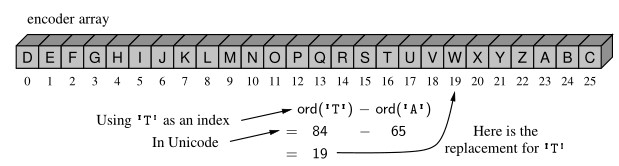

# Simple Applications

## Expression Trees

In this section, we define a new `ExpressionTree` class that provides support for constructing such trees, and for displaying and evaluating the arithmetic expression that such a tree represents. Our `ExpressionTree` class is defined as a subclass of `LinkedBinaryTree`, and we rely on the nonpublic mutators to construct such trees. Each internal node must store a string that defines a binary operator (e.g.,`'+'`), and each leaf must store a numeric value (or a string representing a numeric value).

Our eventual goal is to build arbitrarily complex expression trees for compound
arithmetic expressions such as `'(((3+ 1) × 4)/((9− 5) + 2))'`. However, it suffices
for the ExpressionTree class to support two basic forms of initialization:

- `ExpressionTree(value)`: Create a tree storing the given value at the root.
- `ExpressionTree(op,E1,E2)`: Create a tree storing string op at the root (e.g., `'+'`), and with the structures of existing `ExpressionTree` instances `E1` and `E2` as the *left* and *right* subtrees of the root, respectively.

Such a constructor for the `ExpressionTree` class is given in source code. The class formally inherits from `LinkedBinaryTree`, so it has access to all the non-public update methods that were have defined for this class. We use `_add_root` to create an initial root of the tree storing the token provided as the first parameter. Then we perform run-time checking of the parameters to determine whether the caller invoked the one-parameter version of the constructor (in which case, we are done), or the three-parameter form. In that case, we use the inherited `_attach` method to incorporate the structure of the existing trees as subtrees of the root.

### Composing a Parenthesized String Representation

A string representation of an existing expression tree instance, for example, as `'(((3+1)x4)/((9-5)+2))'` , can be produced by displaying tree elements using an inorder traversal, but with opening and closing parentheses inserted with a preorder and postorder step, respectively. In the context of an `ExpressionTree` class, we support a special `__str__` method that returns the appropriate string. Because it is more efficient to first build a sequence of individual strings to be joined together, the implementation of `__str__` relies on a nonpublic, recursive method named `_parenthesize_recur` that appends a series of strings to a list. These methods are included in source code.

### Expression Tree Evaluation

The numeric evaluation of an expression tree can be accomplished with a simple application of a postorder traversal. If we know the values represented by the two subtrees of an internal position, we can calculate the result of the computation that position designates. Pseudo-code for the recursive evaluation of the value represented by a subtree rooted at position `p` is given in ***Code Fragment*** below.

```python
Algorithm evaluate_recur(p):
    if p is a leaf then
        return the value stored at p
    else
        let o be the operator stored at p
        x = evaluate_recur(left(p))
        y = evaluate_recur(right(p))
        return x o y
```

To implement this algorithm in the context of a Python `ExpressionTree` class, we provide a public evaluate method that is invoked on instance `T` as `T.evaluate()`. **Code Fragment** below provides such an implementation, relying on a nonpublic `_evaluate_recur` method that computes the value of a designated subtree.

```python
def evaluate(self):
    """Return the numeric result of the expression"""
    return self._evaluate_recur(self.root())

def _evaluate_recur(self, p):
    """Return the numeric result of the subtree rooted at position p"""
    if self.is_leaf(p):
        return float(p.element())       # we assume element is numeric
    else:
        op = p.element()
        left_val = self._evaluate_recur(self.left(p))
        right_val = self._evaluate_recur(self.right(p))
        if op == '+': return left_val + right_val
        elif op == '-': return left_val - right_val
        elif op == '/': return left_val / right_val
        else: return left_val * right_val       # treat 'x' or '*' as multiplication 
```

### 📝 Problem (I am finding solution for it)

The `build_expression_tree` method of the `ExpressionTree` class requires input that is an iterable of string tokens. We used a convenient example, `'(((3+1)x4)/((9-5)+2))'`, in which each character is its own token, so that the string itself sufficed as input to `build_expression_tree`. In general, a string, such as `'(35 + 14)'`, must be explicitly tokenized into list `['(', '35', '+', '14', ')']` so as to ignore whitespace and to recognize multi-digit numbers as a single token. Write a utility method, `tokenize(raw)`, that returns such a list of tokens for a *raw* string.

If you have the solution, let contribute to this project [here](ExpressionTree/ExpressionTree.py) by create pull-request.

### Building an Expression Tree

The constructor for the `ExpressionTree` class, provides basic functionality for combining existing trees to build larger expression trees. However, the question still remains how to construct a tree that represents an expression for a given string, such as `'(((3+1)x4)/((9-5)+2))'`.

To automate this process, we rely on a bottom-up construction algorithm, assuming that a string can first be tokenized so that multi-digit numbers are treated atomically, and that the expression is fully parenthesized. The algorithm uses a stack S while scanning tokens of the input expression `E` to find values, operators, and right parentheses. (Left parentheses are ignored.)

- When we see an operator `o`, we push that string on the stack.
- When we see a literal value `v`, we create a single-node expression tree `T` storing `v`, and push `T` on the stack.
- When we see a right parenthesis, `')'`, we pop the top three items from the stack S, which represent a sub-expression `(E1 o E2)`. We then construct a tree `T` using trees for `E1` and `E2` as subtrees of the root storing `o`, and push the resulting tree `T` back on the stack.

We repeat this until the expression `E` has been processed, at which time the top element on the stack is the expression tree for `E`. The total running time is `O(n)`.

An implementation of this algorithm is given in **Code Fragment** below in the form of a stand-alone function named `build_expression_tree`, which produces and returns an appropriate `ExpressionTree` instance, assuming the input has been.

```python
def build_expression_tree(tokens):
    """ Return an ExpressionTree based upon by a tokenized expression """
    S = []                                              # we use Python list as stack
    for t in tokens:
        if t in '+-x*/':                                # t is an operator symbol
            S.append(t)                                 # push the operator symbol
        elif t not in '()':                             # consider t to be literal
            S.append(ExpressionTree(t))                 # push trivial tree storing value
        elif t == ')':                                  # compose a new tree from three constituent parts
            right = S.pop()                             # right subtree as per LIFO
            op = S.pop()                                # operator symbol
            left = S.pop()                              # left subtree
            S.append(ExpressionTree(op, left, right))   # re-push tree
    # we ignore a left parenthesis
    return S.pop()
```

## Simple Cryptography

An interesting application of ***Python strings and lists*** is ***cryptography***, the science of secret messages and their applications. This field studies ways of performing ***encryption***, which takes a message, called the plaintext, and converts it into a scrambled message, called the ***ciphertext***. Likewise, cryptography also studies corresponding ways of performing ***decryption***, which takes a ciphertext and turns it back into its original plaintext.

Arguably the earliest encryption scheme is the ***Caesar cipher***, which is named after *Julius Caesar*, who used this scheme to protect important military messages. (All of Caesar’s messages were written in Latin, of course, which already makes them unreadable for most of us!) The Caesar cipher is a simple way to obscure a message written in a language that forms words with an alphabet.

The Caesar cipher involves replacing each letter in a message with the letter that is a certain number of letters after it in the alphabet. So, in an English message, we might replace each A with D, each B with E, each C with F, and so on, if shifting by three characters. We continue this approach all the way up to W, which is replaced with Z. Then, we let the substitution pattern ***wrap around***, so that we replace X with A, Y with B, and Z with C.

### Converting Between Strings and Character Lists

Given that strings are immutable, we cannot directly edit an instance to encrypt it. Instead, our goal will be to generate a new string. A convenient technique for performing string transformations is to create an equivalent list of characters, edit the list, and then reassemble a (new) string based on the list. The first step can be performed by sending the string as a parameter to the constructor of the list class. For example, the expression `list('bird')` produces the result `['b', 'i', 'r', 'd']` Conversely, we can use a list of characters to build a string by invoking the `join` method on an empty string, with the list of characters as the parameter. For example, the call `''.join(['b', 'i', 'r', 'd'])`

### Using Characters as Array Indices

If we were to number our letters like array indices, so that `A` is `0`, `B` is `1`, `C` is `2`, and so on, then we can write the Caesar cipher with a rotation of `r` as a simple formula: Replace each letter `i` with the letter `(i + r) mod 26`, where `mod` is the ***modulo*** operator, which returns the remainder after performing an integer division. This operator is denoted with`%` in Python, and it is exactly the operator we need to easily perform the wrap around at the end of the alphabet. For `26 mod 26 is 0`, `27 mod 26 is 1`, and `28 mod 26 is 2`. The decryption algorithm for the Caesar cipher is just the opposite—we replace each letter with the one `r` places before it, with wrap around (that is, letter `i` is replaced by letter `(i−r) mod 26`)

We can represent a replacement rule using another string to describe the translation. As a concrete example, suppose we are using a Caesar cipher with a three character rotation. We can precompute a string that represents the replacements that should be used for each character from A to Z. For example, A should be replaced by D, B replaced by E, and so on. The 26 replacement characters in order are `'DEFGHIJKLMNOPQRSTUVWXYZABC'` . We can subsequently use this translation string as a guide to encrypt a message. The remaining challenge is how to quickly locate the replacement for each character of the original message.

Fortunately, we can rely on the fact that characters are represented in Unicode by integer code points, and the code points for the uppercase letters of the Latin alphabet are consecutive (for simplicity, we restrict our encryption to uppercase letters). Python supports functions that convert between integer code points and one-character strings. Specifically, the function `ord(c)` takes a one-character string as a parameter and returns the integer code point for that character. Conversely, the function `chr(j)` takes an integer and returns its associated one-character string.

In order to find a replacement for a character in our Caesar cipher, we need to map the characters `A` to `Z` to the respective numbers 0 to 25. The formula for doing that conversion is `j = ord(c) - ord(A)`. As a sanity check, if character `c` is `'A'`, we have that `j = 0`. When `c` is `'B'`, we will find that its ordinal value is precisely one more than that for
`'A'` , so their difference is 1. In general, the integer `j` that results from such a calculation can be used as an index into our precomputed translation string, as illustrated in ***Figure 1***.



<left>

***Figure 1***: Illustrating the use of uppercase  characters as indices, in this case to
perform the replacement rule for Caesar cipher encryption.
</left>

In source code, we develop a Python class for performing the Caesar cipher with an arbitrary rotational shift, and demonstrate its use. When we run this program (to perform a simple test), we get the following output.

- `Secret: WKH HDJOH LV LQ SODB; PHHW DW MRH’V.`
- `Message: THE EAGLE IS IN PLAY; MEET AT JOE’S.`

The constructor for the class builds the forward and backward translation strings for the given rotation. With those in hand, the encryption and decryption algorithms are essentially the same, and so we perform both by means of a nonpublic utility method named `_transform`.
